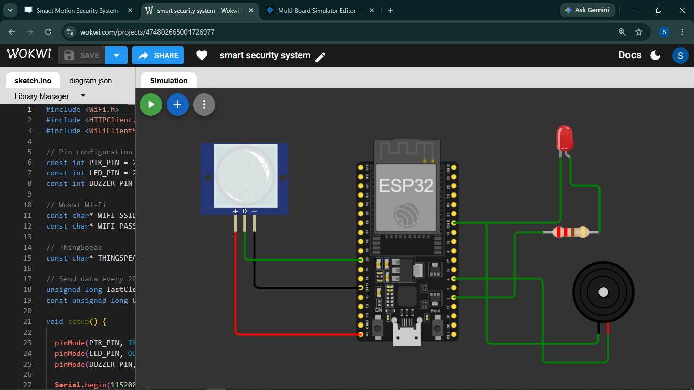
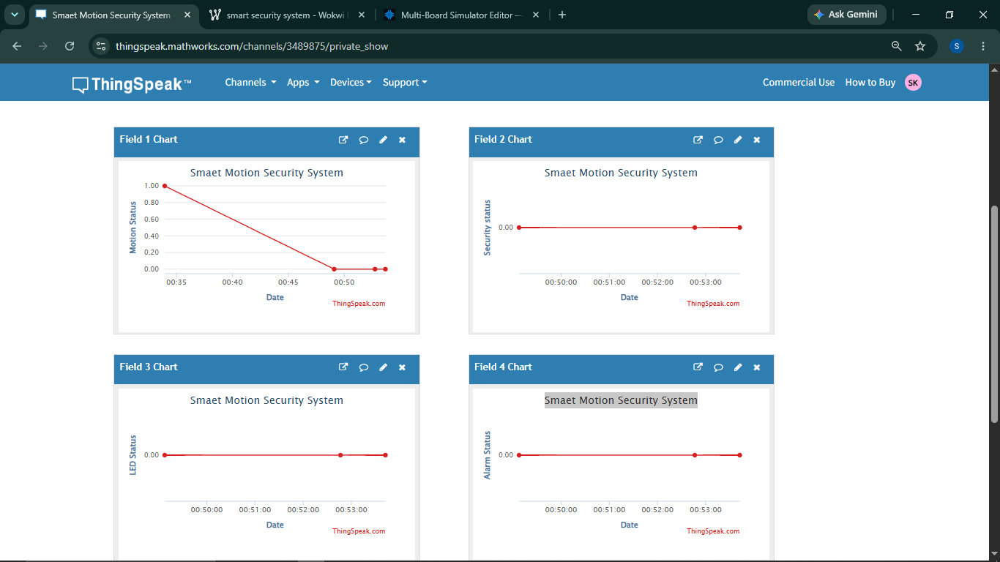

# Task 04 – IoT Cloud Integration & Real-Time Remote Monitoring

## Project Title

**Smart Motion Security System with IoT Cloud Monitoring**

## Objective

The objective of this project is to upgrade the Smart Motion Security System developed in Task 3 into a cloud-connected IoT system.

The ESP32 reads motion from a PIR sensor, controls an LED and buzzer based on the detected motion, and sends the system status to the ThingSpeak cloud platform through Wi-Fi.

The data can then be monitored remotely through the ThingSpeak dashboard.

---

## Components Used

- ESP32 DevKit
- PIR Motion Sensor
- LED
- 220Ω Resistor
- Buzzer
- ThingSpeak Cloud
- Wi-Fi
- Wokwi ESP32 Simulator

---

## Technologies Used

- ESP32
- Embedded C/C++
- Wi-Fi
- ThingSpeak IoT Cloud
- HTTP API
- Wokwi Simulator

---

## Pin Connections

| Component | ESP32 Pin |
|-----------|-----------|
| PIR VCC | VIN / 5V |
| PIR OUT | GPIO 27 |
| PIR GND | GND |
| LED Anode | GPIO 2 through 220Ω resistor |
| LED Cathode | GND |
| Buzzer + | GPIO 4 |
| Buzzer - | GND |

---

## System Working

The PIR sensor continuously monitors the surrounding area for motion.

### When motion is detected

- The ESP32 detects a HIGH signal from the PIR sensor.
- The LED is turned ON.
- The buzzer is activated.
- Motion Status = 1
- Security Status = 1
- LED Status = 1
- Alarm Status = 1

The updated values are sent to ThingSpeak for remote monitoring.

### When no motion is detected

- The LED is turned OFF.
- The buzzer is turned OFF.
- Motion Status = 0
- Security Status = 0
- LED Status = 0
- Alarm Status = 0

The status is also sent to ThingSpeak.

---

## How the Device Sends Data to the Cloud

The ESP32 acts as the main controller of the system.

The data flow is:

**PIR Sensor → ESP32 → Wi-Fi → ThingSpeak API → ThingSpeak Dashboard**

### Step 1 – Reading the Sensor

The ESP32 reads the digital output of the PIR sensor through **GPIO 27**.

A HIGH signal indicates that motion has been detected, while a LOW signal indicates that no motion is detected.

### Step 2 – Local Automation

Based on the PIR sensor reading, the ESP32 controls the connected devices.

When motion is detected, the ESP32 turns ON the LED and buzzer.

When there is no motion, both devices are turned OFF.

### Step 3 – Connecting to Wi-Fi

The ESP32 connects to Wi-Fi using its built-in Wi-Fi capability.

In this project, the ESP32 is simulated using the **Wokwi ESP32 simulator**.

### Step 4 – Sending Data to ThingSpeak

The ESP32 creates a ThingSpeak API request containing the current system status.

Four values are sent:

- Field 1 → Motion Status
- Field 2 → Security Status
- Field 3 → LED Status
- Field 4 → Alarm Status

The data is sent using an HTTP request to the ThingSpeak API.

### Step 5 – Cloud Dashboard

ThingSpeak receives and stores the data and displays it as charts on the cloud dashboard.

This allows the system status to be monitored remotely.

The system sends updated data approximately every **20 seconds**.

---

## ThingSpeak Fields

| ThingSpeak Field | Description | Value |
|------------------|-------------|-------|
| Field 1 | Motion Status | 0 = No Motion, 1 = Motion |
| Field 2 | Security Status | 0 = Secure, 1 = Intrusion |
| Field 3 | LED Status | 0 = OFF, 1 = ON |
| Field 4 | Alarm Status | 0 = OFF, 1 = ON |

---

## Cloud Monitoring

The ThingSpeak dashboard provides four charts for monitoring:

1. Motion Status
2. Security Status
3. LED Status
4. Alarm Status

The dashboard receives data from the ESP32 and displays the changing system values over time.

---

## Project Screenshots

### Circuit Diagram

### ThingSpeak Cloud Dashboard

---

## Files Included

- `smart_motion_security_cloud.ino` – ESP32 source code
- `circuit_diagram.png` – Circuit simulation
- `thingspeak_dashboard.png` – ThingSpeak cloud dashboard
- `README.md` – Project documentation

---

## Outcome

The Smart Motion Security System was successfully upgraded into a cloud-connected IoT system.

The project demonstrates:

- Motion sensing using a PIR sensor
- Automated LED and buzzer control
- ESP32 Wi-Fi connectivity
- Device-to-cloud communication
- ThingSpeak API integration
- Real-time cloud monitoring through charts
